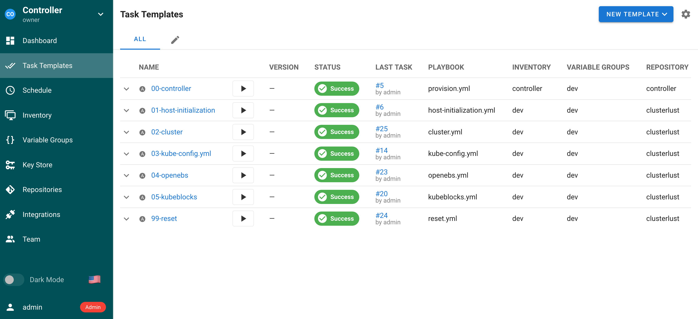

# Ansible Controller with SemaphoreUI

This project provides a development environment for deploying an Ansible Controller with SemaphoreUI. In this setup, Semaphore runs within a Docker container, while other components, such as PostgreSQL and Nginx, run directly on the host system.



## Contents

- [Overview](#overview)
- [Installation](#installation)
- [Configuration](#configuration)
- [Usage](#usage)
- [Contributing](#contributing)
- [License](#license)

## Overview

This project automates the deployment of an Ansible Controller featuring a web-based interface through SemaphoreUI. Semaphore runs within a Docker container, while components like PostgreSQL and Nginx operate directly on the host system.

## Installation

Follow these steps to set up the environment:

1. **Prerequisites**:

   **Note**: The `inventory/local` configuration is suitable for direct deployment on systems like Red Hat, AlmaLinux, or Rocky Linux. In this setup, Vagrant and VirtualBox are not required.
   - [VirtualBox](https://www.virtualbox.org/), installed on your laptop.
   - [Vagrant](https://www.vagrantup.com/) installed on your laptop.

2. **Clone the repository**:

   ```bash
   git clone https://github.com/bbaassssiiee/controller.git
   cd controller
   ```
3. **Install Ansible in a Python virtualenv**:

   ```bash
    source ansible.sh
    ./prepare.sh
   ```

4. **Define the environment variables and inventory/name/group_vars**:

   Define these secrets as environment variables, store them in a safe place afterwards:

   ```bash
   export DB_PASS=your_database_password
   export SSH_PASSPHRASE=KeyWillBeGeneratedWithAPassphrase
   ```
   ```json
   {
      "ansible_connection": "local",
      "ansible_host": "localhost",
      "database": {
         "postgres": {
               "enabled": true,
               "name": "postgres",
               "owner": "postgres",
               "password": "{{ lookup('env', 'DB_PASS') }}",
               "username": "postgres"
         },
         "semaphore": {
               "enabled": true,
               "name": "semaphore",
               "owner": "semaphore",
               "password": "{{ lookup('env', 'DB_PASS') }}",
               "username": "semaphore"
         }
      },
      "docker_install_compose": true,
      "docker_install_compose_plugin": true,
      "postgres_enabled": true,
      "semaphore_web_root": "https://controller",
      "server_name": "{{ lookup('env', 'HOSTNAME') }}",
      "ssh_passphrase": "{{ lookup('env', 'SSH_PASS') }}"
   }
   ```
5. **Run the playbook**:
   Execute the Ansible playbook to provision to the default 'local' inventory:
   ```bash
   ./provision.yml --list-tags

   playbook: ./provision.yml

   play #1 (database): Database Server	TAGS: []
         TASK TAGS: [postgres]

   play #2 (semaphore): Semaphore in Docker	TAGS: []
         TASK TAGS: [docker, semaphore]

   play #3 (web): Reverse Proxy	TAGS: []
         TASK TAGS: [nginx]

   play #4 (semaphore): Configure Semaphore	TAGS: []
         TASK TAGS: [semaphore]
   ```

## Configuration

- **SSL Certificates**: By default, self-signed certificates are used. For production environments, it is recommended to implement certificates from a trusted certificate authority.

- **Database**: Ensure that the `DB_PASS` environment variable is set with a strong password before running the playbook. To disable installation of Postgres and use your own intance set `postgres_enabled: false`

- **Software Environments**: This project contains three inventories, but can be run with inventories define in external repositories modeled after the examples.


## Usage

After successful installation, SemaphoreUI is accessible via your web browser at the address configured.

To remove Semaphore run:
```bash
./provision.yml --tags semaphore -e desired_state=absent
```

To reinstall Semaphore run with the default `desired_state`, i.e. _present_:
```bash
./provision.yml --tags semaphore
```

## Contributing

Contributions are welcome! Feel free to submit pull requests or open issues for suggestions and improvements.

## License

This project is licensed under the MIT License. See the [LICENSE](LICENSE) file for more information.
